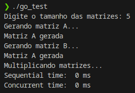
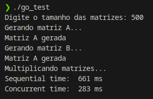
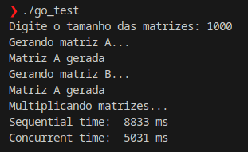
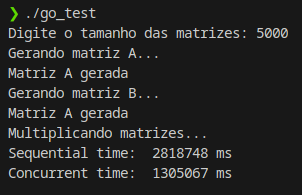

# Avaliação paralelismo - Go

Podemos ver que, quando maior for o tamanho da matiz, mais o processamento paralelo se difere do processamento não paralelo

### Exemplos

##### 5 x 5

##### 500 x 500

##### 1000 x 1000

##### 5000 x 5000

##### 20000 x 20000

Não foi possível calcular o tempo para uma matriz de 20.000 x 20.000. Foi deixado durante 18 horas com a tentativa de sucesso, mas apenas as matrizes foram criadas.

Sem sucesso ao chegar ao fim da multiplicação, coloquei as aproximações a cima, levando em conta que sua multiplicação é O(n³).
